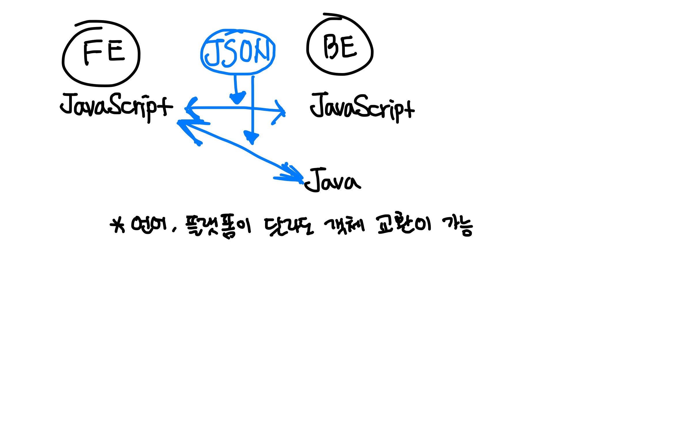

# DataFormat #JSON

### **데이터 사전적 의미**

1.  이론을 세우는 데 기초가 되는 사실, 자료
2.  프로그램을 운용할 수 있는 형태로 기호화/숫자화한 자료.

이러한 데이터를 컴퓨터간 주고 받기 위해서는 약속(포맷)을 정하고 주고 받아야 한다. <br/>
포맷으로 대표적으로 `JSON`, `XML` 이 있다.

## JSON

**`Javascript` 객체 문법**으로 구조화된 *데이터를 표현*하기 위한 표준 포맷 <br/>
(`Javascript` 와 마냥 같진 않음)

### 예시

```json
{
  "group": "NewJeans",
  "member": [
    {
      "name": "민지",
      "age": 20
    },
    {
      "name": "하니",
      "age": 20
    },
    {
      "name": "다니엘",
      "age": 19
    },
    {
      "name": "해린",
      "age": 18
    },
    {
      "name": "혜인",
      "age": 16
    }
  ]
}
```

### 특징

- key : value 형태로 나타낼 수 있다.
- `Javascript`의 String, Number, Array, boolean, null + 다른 Object 포함
- undefined, method 포함 불가능
- 각 Object내에 다른 타입 포함 가능
  ```json
  {
    "name": "혜인",
    "age": 16
  }
  ```
- Javascript와 호환성 높음
- 작은 따옴표 X, 큰 따옴표 O

### 장점

`JSON`은 텍스트로 이루어져 있으므로, 한 눈에 알아보기 쉬움 <br/>
**서로 다른 시스템**간에 객체를 교환하기 용이, 주로 API, Config 활용되며 **가벼움**

